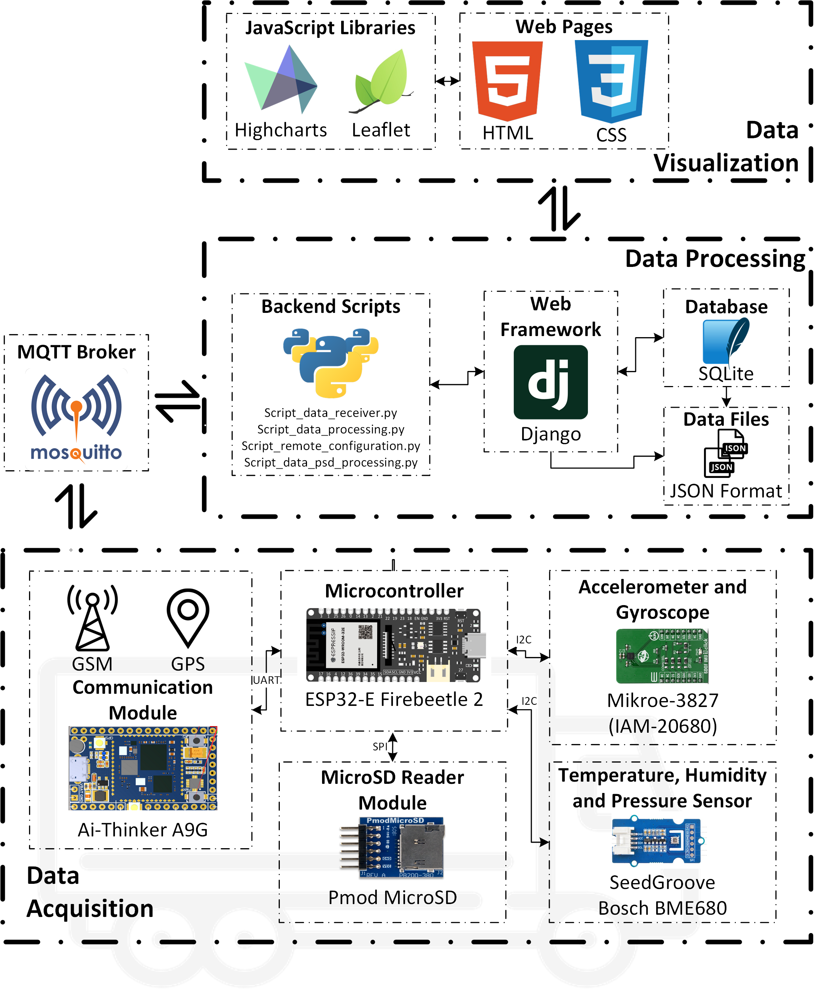
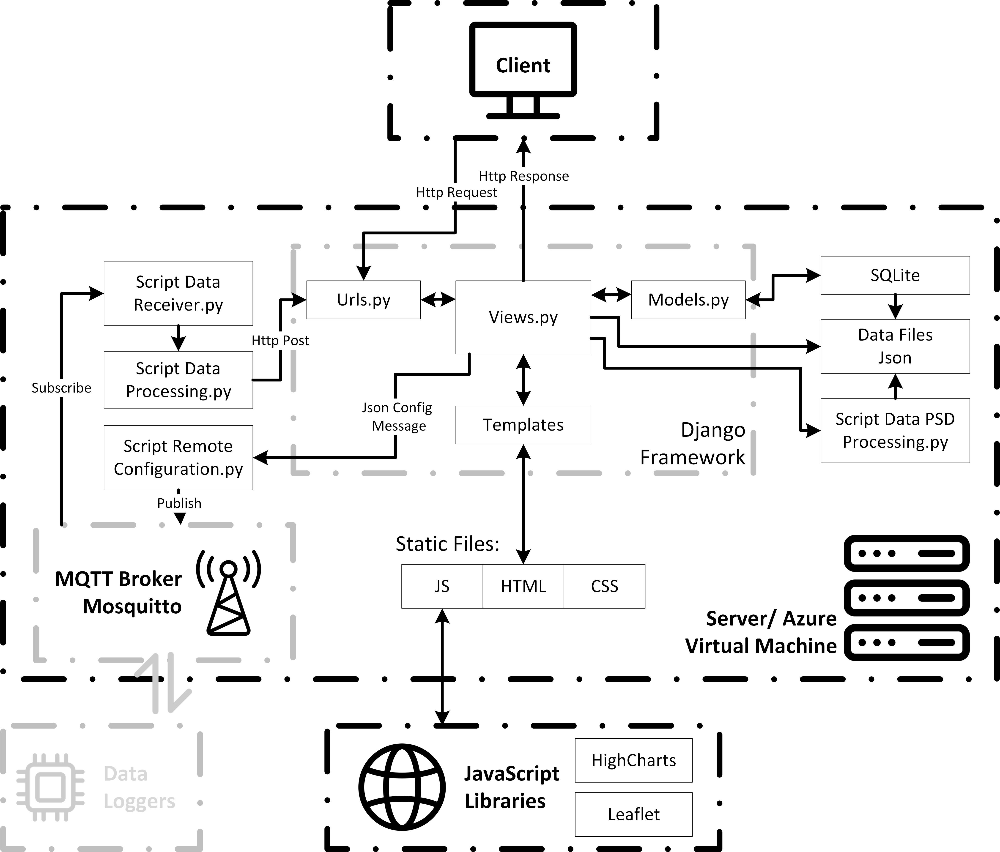
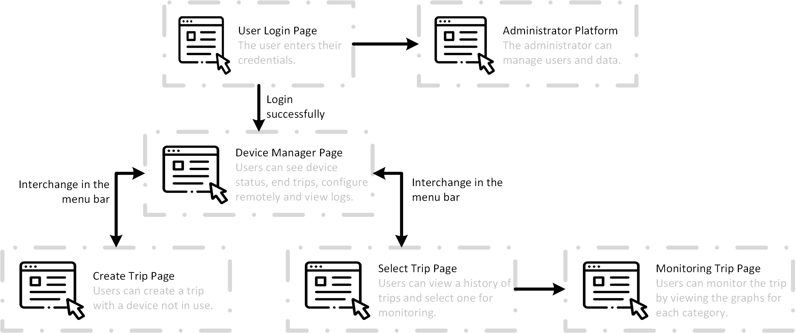
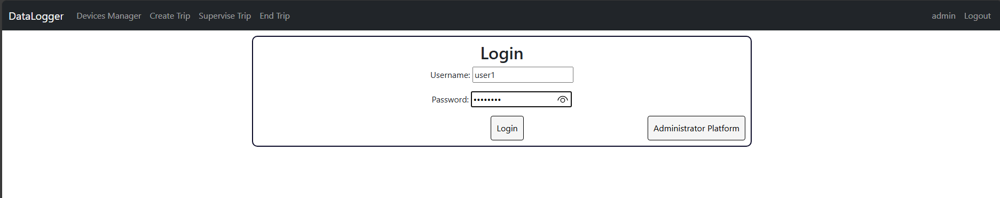
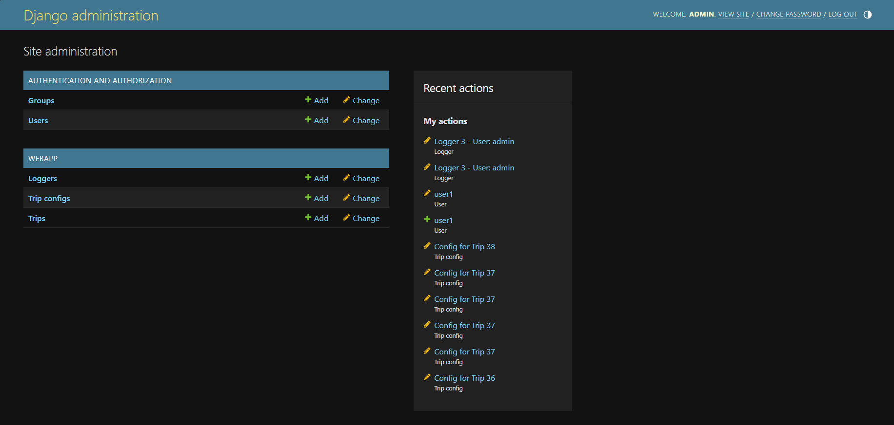
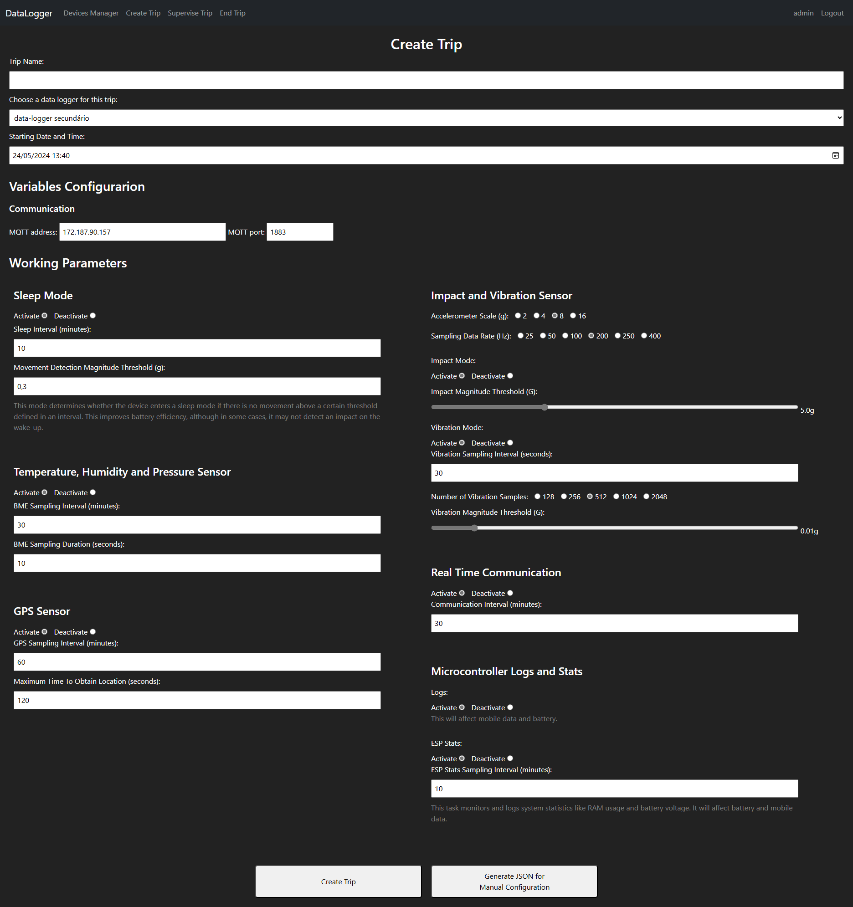
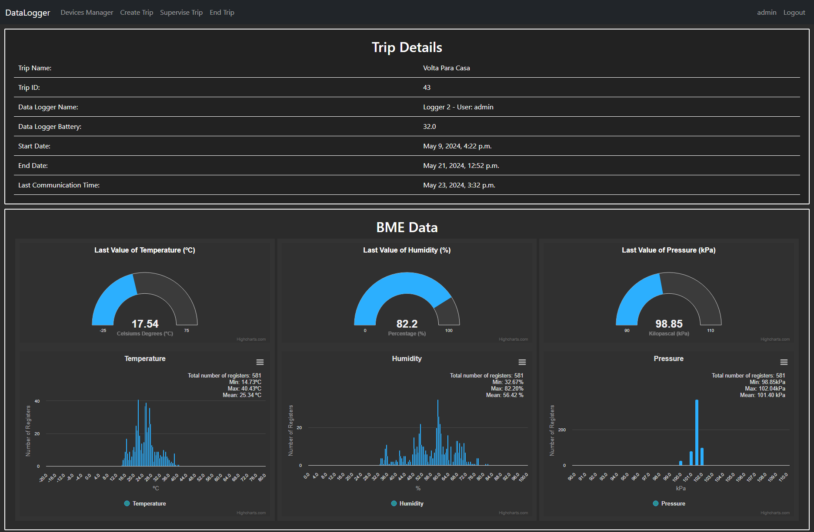
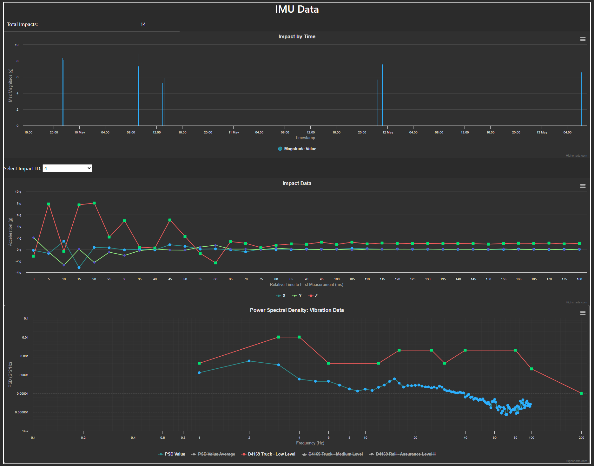

# Data Logger Project

## Overview
This repository contains the implementation of a data logger project designed for real-time and remote data acquisition during the shipment of products. The project includes scripts for data processing, device software, and a web interface for data visualization and control.

## Repository Structure

- **Back-End Scripts**: Scripts for data processing and storage.
- **Device Software (Microcontroller)**: Code for the microcontroller used in the data logging device.
- **Django Web-Framework**: Web application framework for interfacing with the data logger.
- **Tests and Results**: Testing scripts and result logs.

## Description of the Implemented Solution

The data logger system uses the ESP32-E Firebeetle 2 microcontroller as the main unit. It works with several sensors to meet the project's requirements:

- **Vibration and Impact Monitoring**: Uses the IAM-20680 accelerometer and gyroscope.
- **Environmental Monitoring**: Uses the BME680 sensor to measure temperature, humidity, and pressure. Both sensors communicate with the microcontroller using the I2C protocol.
- **Data Storage**: Uses a PMod microSD reader module, which communicates via the SPI protocol, for local data storage.
- **Mobile Communication and GPS**: Uses the Ai-Thinker A9G module for mobile network communication and GPS tracking, interfacing via the UART protocol.

Data is sent using the MQTT protocol. Back-end scripts receive this data, convert it to JSON format, and send it to the Django web framework using HTTP Post requests.

##### Django Web Platform

The Django framework manages the data and web platform, providing features such as:

- **Data Storage**: Uses an SQLite database to store user information, trip details, configurations, and data file paths.
- **Interactive Visualization**: Uses JavaScript libraries like Highcharts for graphs and Leaflet for maps to show dynamic data on the trip monitoring page.




## Data Acquisition
### Microcontroller Program

The microcontroller program is developed using the ESP32 microcontroller and various sensors to monitor parameters such as temperature, humidity, pressure, impacts, vibration, and location. The code is structured into tasks that handle sensor readings, data storage, and communication with the web platform via MQTT.

### Key Components:
- **ESP32 Microcontroller**: Handles sensor integration and data processing.
- **Sensors**: Include BME680 for environmental data, IMU for motion data, and GPS for location tracking.
- **SD Card**: For local data storage.
- **MQTT Protocol**: For real-time data transmission to the web platform.

### Running the Microcontroller Program:
1. **Set Up the Development Environment**:
   - Install the necessary tools and libraries for ESP32 development.
   - Use the Arduino IDE or PlatformIO for code uploading.

2. **Upload the Code**:
   - Connect the ESP32 to your computer.
   - Compile and upload the code from the `microcontroller` directory.

3. **Configure MQTT**:
   - Ensure the MQTT broker details in the code match your setup.
   - The device will start collecting data and transmitting it to the web platform.


## Data Processing and Visualization

The data processing and visualization for the data logger system is managed through a series of scripts and a Django-based web platform. The system architecture and the functions of each script are described below.

### System Architecture

1. **Data Acquisition**:
   - The data logger devices collect data on temperature, humidity, pressure, impacts, vibration, and location.
   - This data is transmitted to the MQTT Broker (Mosquitto) using the MQTT protocol.

2. **Data Processing**:
   - **Script Data Receiver**: Subscribes to the MQTT topics to receive data from the data loggers.
   - **Script Data Processing**: Processes the raw data, converts it into JSON format, and prepares it for storage and visualization.
   - **Script Remote Configuration**: Publishes configuration settings to the data loggers.

3. **Data Storage and Management**:
   - The processed data is stored in an SQLite database, which keeps information about users, trips, trip configurations, and data file paths.
   - Additional processing by **Script Data PSD Processing** converts the raw data for FFT segments into Power Spectral Density (PSD) format for further analysis in the web platform.

4. **Web Framework (Django)**:
   - **Views.py**: Handles HTTP requests and returns responses to the client. It interacts with the models and templates to fetch and display data.
   - **Models.py**: Defines the database schema and interacts with the SQLite database to retrieve and store data.
   - **Urls.py**: Maps URLs to the corresponding views, enabling navigation within the web application.
   - **Templates**: HTML files that render the data into user-friendly web pages.

5. **Visualization**:
   - The web platform uses JavaScript libraries such as Highcharts and Leaflet for interactive data visualization.
   - **Highcharts**: Generates interactive graphs to display real-time and historical data on environmental conditions and impacts.
   - **Leaflet**: Provides map visualizations with recorded GPS points for tracking the location of shipments.

### Process Flow

- Data is continuously collected by the data loggers and transmitted via MQTT.
- The **Script Data Receiver** listens for incoming data and passes it to the **Script Data Processing**.
- Processed data is stored in the SQLite database and can be accessed through the Django web platform.
- Users can interact with the platform to configure devices, monitor ongoing trips, and visualize data through dynamic graphs and maps.




### Running the Django Application

1. **Clone the Repository**:
   ```bash
   git clone https://github.com/jorgeedribeiro2001/data_logger_project.git
   cd data_logger_project
   ```

2. **Install Dependencies**:
   - For Python components, use the requirements file:
     ```bash
     pip install -r requirements.txt
     ```

3. **Run the Django Application**:
   - Navigate to the Django project directory:
     ```bash
     cd django_project
     ```
   - Apply migrations:
     ```bash
     python manage.py migrate
     ```
   - Create a superuser to access the admin interface:
     ```bash
     python manage.py createsuperuser
     ```
   - Start the development server:
     ```bash
     python manage.py runserver
     ```
   - Access the application at `http://127.0.0.1:8000/`.
  
For running for the internet make sure that you have an Public IP and a port available to public. For running on the port you can:

```bash
python manage.py runserver 0.0.0.0:8000
```
It is notable that the platform was not developed for public porposes and not went with any security concerns.


To run the Django application over the internet, ensure you have a public IP address and an available port. Follow these steps to run the application:

1. **Open the Server to External Access**:
   Run the Django development server with the following command to make it accessible over the internet:
   ```bash
   python manage.py runserver 0.0.0.0:8000
   ```

2. **Public IP and Port**:
   - Ensure your server's firewall allows traffic on the specified port (e.g., 8000).
   - Configure your router to forward incoming traffic on this port to your server if running behind a NAT.

3. **Security Considerations**:
   - This platform was developed for demonstration purposes and internal use only.
   - It lacks security features necessary for a public-facing application.
   - If you intend to make this application accessible over the internet, implement proper security measures such as HTTPS, firewalls, authentication, and regular security audits.

4. **Deployment Recommendations**:
   - For production deployment, use a robust web server like Nginx or Apache as a reverse proxy.
   - Consider using a WSGI server like Gunicorn or uWSGI to serve the Django application.
   - Set up SSL/TLS certificates for secure HTTPS connections.


### Graphical Interface

The graphical interface of the data logger system includes several user-accessible pages designed as adaptable templates. These templates ensure that the HTML pages dynamically respond to user requests. For instance, when a user monitors a trip, the page's structure and elements adjust automatically to display the specific trip data selected by the user. Below is a visual representation of the hierarchical structure of these pages:


*Figure: Web Pages Interaction Diagram*

#### Page Descriptions

##### User Login Page
The user login page is the primary access point for users. It features a straightforward interface where users can enter their credentials. Upon successful login, users are redirected to the appropriate dashboard. Administrators can also access the administrative platform from this page.


*Figure: User Login Layout*

##### Administrator Platform
This platform is accessible only to administrators. It provides comprehensive data access and user management capabilities, allowing administrators to manage users, modify values in the SQLite database, and oversee data collected by the devices.


*Figure: Administrator Platform Layout*

##### Device Manager Page
Upon logging in, users are redirected to the Device Manager page. This page can also be accessed via the menu bar. It requires user authentication and displays the devices added by the user. Administrators can view all devices. Users can see device status, end trips, configure devices remotely, and view logs.


*Figure: Device Manager Page Layout*

##### Create Trip Page
This page allows users to create a new trip and configure the associated device settings. Users can navigate to this page via the menu bar or through a specific link. They can define the trip name, select an available data logger, and set the start date. Configuration parameters can be set, and a JSON file can be generated for saving on the user's computer.


*Figure: Create Trip Page Layout*

##### Select Trip Page
The Select Trip page allows users to view and select from a list of their trips. Users can delete a trip or proceed to monitor it. This page is accessible via the menu bar and requires user authentication.


*Figure: Select Trip Page Layout*

##### Monitoring Trip Page
This page is crucial for data analysis and visualization. It is divided into sections for general trip details, BME data (temperature, humidity, pressure), IMU data (impact, vibration), and location data. Each section provides detailed analysis and interactive graphs.


*Figure: Monitoring Page: Trip Details and BME Data Sections Layout*


*Figure: Monitoring Page: IMU Data Section Layout*


*Figure: Monitoring Page: Location Section Layout*

#### JavaScript Libraries
The interactive graphs and maps are created using the Highcharts and Leaflet JavaScript libraries. Highcharts is used for generating interactive graphs, while Leaflet is used for creating interactive maps with recorded position points. These tools provide dynamic visualization of the data collected by the data logger devices.

This graphical interface ensures a user-friendly and efficient way to manage devices, create and monitor trips, and visualize data for analysis, making it a vital part of the data logger system.


## Contribution

1. Fork the repository.
2. Create a new branch (`git checkout -b feature-branch`).
3. Commit your changes (`git commit -m 'Add some feature'`).
4. Push to the branch (`git push origin feature-branch`).
5. Open a pull request.

## License
This project is licensed under the MIT License.

## Contact
For any queries, contact the repository owner.

---
